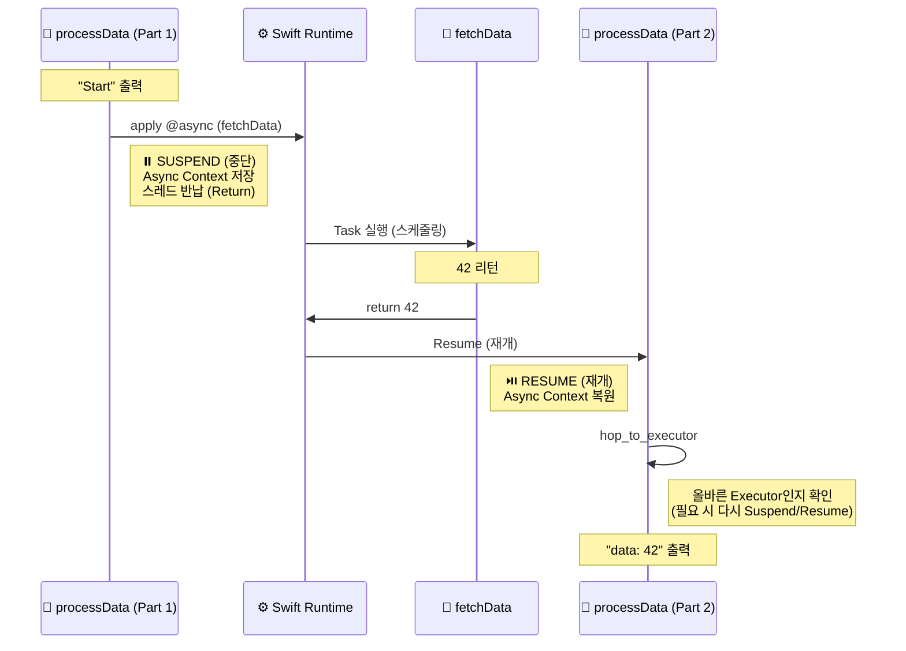

# Async / Await

발표자: Ian Lee
작성일: 2025년 12월 9일
주제: Async / Await

## 1. Async / Await의 Core-Concept

## **중단(Suspension) & 양보(Yielding)**

### 1️⃣ **중단(Suspension) vs 차단(Blocking)**

- **Blocking (나쁜 예)**: 커피 나올 때까지 카운터 앞에서 폰 보며 서 있는 손님 - 뒷사람 막힘
- **Suspension (좋은 예)**: 진동벨 받고 자리에 앉아 있는 손님 - 카운터 비워짐.

### 2️⃣ **양보 (Yielding): 스레드를 독점하지 않음**

- **Cooperative Threading**: Swift Concurrency는 스레드가 몇 개 없음. (CPU 코어 수 + 1만큼만 생성됨)
    - 따라서, 한 작업이 스레드를 오래 붙들고 있으면 앱 전체가 멈춤
- **Voluntary Suspension**: 무거운 작업 중간에 `await Task.yield()`를 호출해서
    - "나 잠깐 쉴게, 급한 다른 애들 먼저 해"라고 양보해야 함
- **질문**: 그럼 앉아있는 동안(중단된 동안) 하던 일은 어디 저장되나요?
    - Preview: Stack이 아닌 heap에 저장됩니다. Section 3에서 공개됩니다.

## 2. Async / Await 해부 1 (SIL)

### **1️⃣ Coroutine Splitting (함수 쪼개기)**

컴파일러는 `await`를 만나는 순간, 하나의 함수를 여러 개의 `funclet`(작은 함수 조각) 으로 쪼갭니다. 이 과정을 `Spliting`이라고 함

**원본 코드:**

```swift
func process() async {
    print("A")
    await fetchData() // 중단점
    print("B")
}
```

**컴파일러가 바라보는 구조 (Pesudo)**

```swift
// 조각 1: 시작 부분
func process_part1(context: AsyncContext) {
    print("A")
    // fetchData를 호출하고, 끝나면 'process_part2'를 실행하라고 등록
    call_async(fetchData, completion: process_part2)
    return // 스레드 반납 (Suspend)
}
// 조각 2: 재개 부분 (Continuation)
func process_part2(context: AsyncContext, result: Data) {
    // 힙에 저장해둔 context를 다시 불러옴
    print("B")
    return // 종료
}
```

`llvm.coro.suspend`와 `llvm.coro.resume` Intrinsic으로 함수 split을 구현하고 있습니다 (fyi)

### 2️⃣ **SIL에서의 흔적으로 딥 다이브**

```swift
// async_sample.swift

func fetchData() async -> Int {
    return 42
}

func processData() async {
    print("Start")
    let data = await fetchData()
    print("End: \(data)")
}
```

**SIL 핵심 부분:**

```swift
// processData()
sil hidden @processData : $@convention(thin) @async () -> () {
bb0:
  // 1. Executor 확인 (초기화)
  %0 = enum $Optional<Builtin.Executor>, #Optional.none!enumelt
  hop_to_executor %0 : $Optional<Builtin.Executor> // executor 명시
  // ... (문자열 "Start" 생성 및 출력) ...
  // 2. async 함수 호출 (중단점 후보)
  // function_ref fetchData()
  %28 = function_ref @fetchData : $@convention(thin) @async () -> Int
  
  // ⚠️ apply @async: 여기서 잠재적 중단(Suspension) 발생
  // 컴파일러는 이 지점을 기준으로 함수를 쪼갭니다.
  %29 = apply %28() : $@convention(thin) @async () -> Int
  // 3. 재개 후 Executor 복귀 (Resumption)
  // await가 끝난 후, 원래 실행하던 Executor(여기서는 Generic)로 돌아옴을 보장
  hop_to_executor %0 : $Optional<Builtin.Executor>
  // ... (결과 "data" 출력) ...
  
  return %97 : $()
}
```



### 3️⃣ **핵심 포인트**

1. **`apply @async`**: 일반적인 함수 호출(**apply**)과 달리, `@async` 속성이 붙어 있습니다. 이는 컴파일러에게 `이 호출은 비동기이며, 여기서 중단될 수 있음`을 알립니다.
2. **`hop_to_executor`**: **await** 호출이 끝나고 돌아왔을 때, 코드가 **어디서(Which Executor)** 실행되어야 하는지를 강제합니다.
    - 예: `@MainActor` 함수였다면, `hop_to_executor MainActor`가 삽입되어 메인 스레드로 점프합니다.
3. **Implicit Splitting**: SIL 코드 상에서는 하나의 `bb0` 블록에 쭉 이어져 보이지만, 실제 기계어 생성(IRGen) 단계에서는 `apply @async`를 기준으로 앞부분(Part 1)과 뒷부분(Part 2)으로 코드가 물리적으로 분리됩니다.

## 3. Async / Await 해부 - 런타임 deep dive

### **1️⃣ Async Context (힙 메모리)**

`async` 함수가 호출되면 **Stack Frame** 대신 **`Async Context`**라는 덩어리가 **Heap**에 할당됩니다.  

실제 Swift 런타임(**include/swift/ABI/Task.h**)에 정의된 구조는 다음과 같습니다.

**기본 헤더 (16 Bytes on 64-bit):**

```cpp
class AsyncContext {

public:
  AsyncContext *Parent;                       // +0: 부모 컨텍스트 (Caller)
  
  TaskContinuationFunction *ResumeParent;     // +8: 재개 함수 포인터 (Return Address)
};
```

**실제 메모리 레이아웃 예시:**

| **오프셋** | **크기** | **내용** | **설명** |
| --- | --- | --- | --- |
| `+0x0020` | 8 bytes | **Parent Context** | 나를 호출한 함수의 Context 주소 |
| `+8` | 8 bytes | **Resume Function** | 이 함수가 끝난 후 돌아갈 코드 주소 |
| `+16` | 가변 | **Local Variables** | 컴파일러가 생성한 지역 변수 저장 공간 |
| `...` | ... | **Child Contexts** | (필요 시) 하위 호출을 위한 공간 |

### 2️⃣ 중단(Suspend)

1. 현재 레지스터 값(CPU 상태)을 **Async Context**에 저장합니다.
2. `Resume Function Pointer`를 다음 실행할 조각(`process_part2`)으로 업데이트합니다.
3. 현재 스레드에서 `return` 해버립니다. 스레드는 자유의 몸이 됨

### 3️⃣ 재개(Resume)

1. 작업이 끝난 스레드가 **Async Context**를 힙에서 찾습니다.
2. 저장된 `Resume Function Pointer`를 읽어서 그 함수를 호출합니다.
3. 저장된 변수들을 다시 레지스터로 불러옵니다.
4. 마치 아무 일도 없었던 것처럼 이어서 실행합니다.
