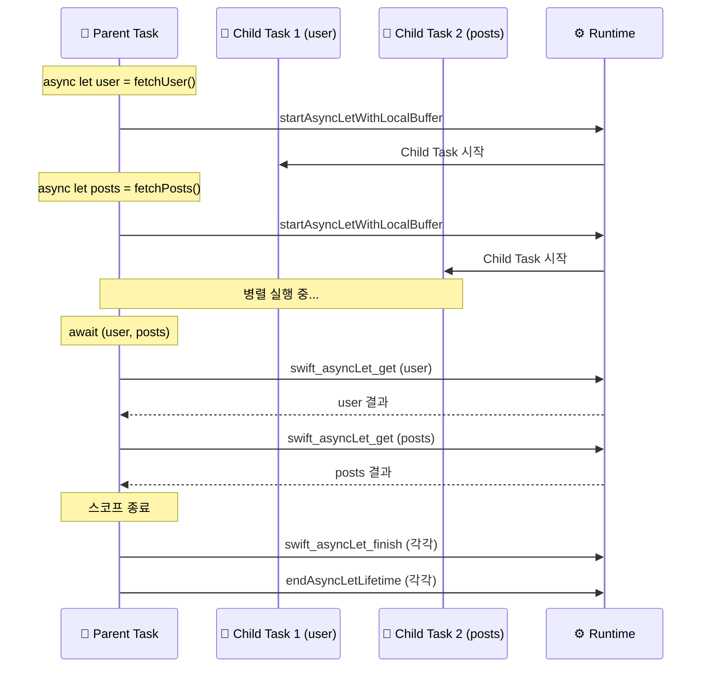
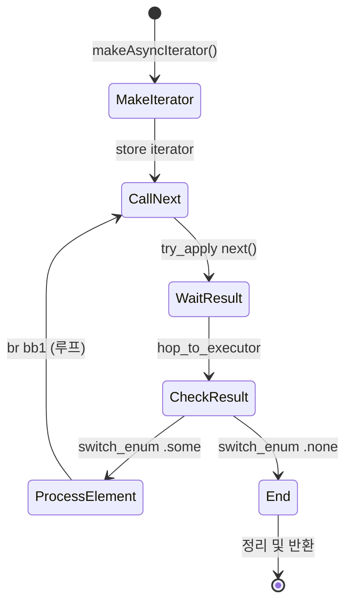

# Async Let / For Await (AsyncSequence)

발표자: Jerome
작성일: 2025년 12월
주제: async let, for await (AsyncSequence)

---

## 🎯 1. Core Concept

### async let: "동시에 시작하고, 나중에 모아서 기다리기"

> **async let**은 **Structured Concurrency**의 핵심으로, 여러 비동기 작업을 **동시에 시작**하고 **스코프 종료 시 자동 정리**를 보장합니다.

**비유: 레스토랑 주문**
- **순차 주문 (await)**: 스테이크 주문 → 완성 → 샐러드 주문 → 완성 → 디저트 주문 → 완성 (느림)
- **동시 주문 (async let)**: 스테이크, 샐러드, 디저트를 **동시에** 주문 → 모두 완성되면 받기 (빠름)

### for await: "비동기 스트림을 하나씩 처리하기"

> **for await**는 **AsyncSequence**에서 **비동기적으로 도착하는 요소**를 순차적으로 처리합니다.

**비유: 컨베이어 벨트**
- 요소가 **도착할 때마다** 하나씩 처리
- 다음 요소가 도착할 때까지 **중단(suspend)** 후 대기
- 시퀀스가 끝나면(nil) 루프 종료

---

## 🔎 2. 언어 스펙 (Language Spec)

### async let 문법

```swift
func fetchAll() async -> (User, [Post]) {
    // 두 작업을 동시에 시작 (병렬 실행)
    async let user = fetchUser()
    async let posts = fetchPosts()
    
    // 모든 결과를 기다림
    return await (user, posts)
}
```

### for await 문법

```swift
func processStream() async throws {
    for await value in someAsyncSequence {
        print(value)
    }
    // 시퀀스 종료 후 실행
}
```

### 컴파일 타임 보장

| 규칙 | 설명 |
|-----|------|
| **스코프 종료 시 await 필수** | async let 값은 스코프 끝에서 반드시 await됨 |
| **자동 취소** | await 없이 스코프 종료 시 자동 cancel |
| **Sendable 강제** | async let 클로저는 @Sendable 필수 |

### 오용 시 컴파일 에러 케이스

```swift
// ❌ Case 1: async let 값을 await 없이 반환 시도
func wrong() async -> String {
    async let value = fetchData()
    return value  // ❌ Error: Expression is 'async' but is not marked with 'await'
}

// ❌ Case 2: async let을 스코프 밖으로 이동
func wrong2() async {
    var result: Task<String, Never>?
    async let value = fetchData()
    result = value  // ❌ Error: async let만 가능
}
```

---

## 🔬 3. SIL 분석 (SIL Observation)

### 샘플 코드

```swift
func fetchAll() async -> (String, [String]) {
    async let user = fetchUser()
    async let posts = fetchPosts()
    return await (user, posts)
}
```

### SIL 생성 명령어

```bash
swiftc -emit-sil -Onone async_let_sample.swift > async_let_sample.sil
```

### async let SIL 핵심 부분

```
// fetchAll() - async let 처리
sil hidden @fetchAll : $@convention(thin) @async () -> (@owned String, @owned Array<String>) {
bb0:
  hop_to_executor %0
  
  // 1️⃣ async let user = fetchUser() → Child Task 시작
  %5 = function_ref @implicit closure #1  // fetchUser 래핑
  %8 = builtin "startAsyncLetWithLocalBuffer"<String>(%4, %7, %3) : $Builtin.RawPointer
  
  // 2️⃣ async let posts = fetchPosts() → 또 다른 Child Task 시작
  %12 = function_ref @implicit closure #2  // fetchPosts 래핑
  %15 = builtin "startAsyncLetWithLocalBuffer"<[String]>(%11, %14, %10) : $Builtin.RawPointer
  
  // 3️⃣ await user → 결과 대기
  %16 = function_ref @swift_asyncLet_get
  %17 = apply %16(%8, %3)  // user 결과 가져오기
  
  // 4️⃣ await posts → 결과 대기
  %20 = function_ref @swift_asyncLet_get
  %21 = apply %20(%15, %10)  // posts 결과 가져오기
  
  // 5️⃣ 정리 (스코프 종료)
  %24 = function_ref @swift_asyncLet_finish
  %25 = apply %24(%15, %10)  // posts 정리
  hop_to_executor %0
  %27 = builtin "endAsyncLetLifetime"(%15) : $()
  
  %29 = function_ref @swift_asyncLet_finish
  %30 = apply %29(%8, %3)  // user 정리
  hop_to_executor %0
  %32 = builtin "endAsyncLetLifetime"(%8) : $()
  
  return %34 : $(String, [String])
}
```

### async let SIL 분석 포인트

| SIL 명령어 | 의미 |
|-----------|------|
| `startAsyncLetWithLocalBuffer` | Child Task 생성 및 즉시 시작 |
| `swift_asyncLet_get` | 결과가 준비될 때까지 대기 (Suspension Point) |
| `swift_asyncLet_finish` | Task 완료 대기 및 리소스 정리 |
| `endAsyncLetLifetime` | async let 생명주기 종료 표시 |
| `implicit closure` | async let 표현식이 @Sendable 클로저로 변환됨 |

### for await SIL 핵심 부분

```
// processSequence() - for await 처리
sil hidden @processSequence : $@convention(thin) @async () -> () {
bb0:
  // 1️⃣ Iterator 생성
  %8 = function_ref @Counter.makeAsyncIterator()
  %9 = apply %8(%7) : Counter.AsyncIterator
  store %9 to %2  // 저장
  br bb1  // 루프 시작

bb1:  // 루프 헤드
  // 2️⃣ next() 호출 (Suspension Point)
  %15 = function_ref @AsyncIteratorProtocol.next(isolation:)
  try_apply %15(%12, %16, %13, %14) : ... , normal bb2, error bb5

bb2:  // next() 성공
  hop_to_executor %0
  // 3️⃣ Optional 분기
  switch_enum %22, case #Optional.some: bb3, case #Optional.none: bb4

bb3(%25 : $Int):  // 값이 있음 → 루프 본문 실행
  debug_value %25, let, name "number"
  // print(number) 등 처리
  br bb1  // 다음 반복

bb4:  // nil → 루프 종료
  // 정리 및 반환
}
```

### for await SIL 분석 포인트

| SIL 명령어 | 의미 |
|-----------|------|
| `makeAsyncIterator()` | AsyncSequence → Iterator 변환 |
| `try_apply next()` | 다음 요소 요청 (Suspension Point) |
| `switch_enum` | Optional 분기 (some → 계속, none → 종료) |
| `br bb1` | 루프 반복 (back edge) |

---

## 📂 4. Swift 오픈소스 구현

### 담당 파일

| 역할 | 파일 경로 |
|-----|----------|
| async let SIL 생성 | `lib/SILGen/SILGenApply.cpp` |
| 런타임 (async let) | `stdlib/public/Concurrency/AsyncLet.swift`, `AsyncLet.cpp` |
| AsyncSequence 정의 | `stdlib/public/Concurrency/AsyncSequence.swift` |
| AsyncIterator 정의 | `stdlib/public/Concurrency/AsyncIteratorProtocol.swift` |

### 핵심 함수/타입

```swift
// stdlib/public/Concurrency/AsyncLet.swift
@_silgen_name("swift_asyncLet_get")
func swift_asyncLet_get(
    _ alet: Builtin.RawPointer,
    _ buffer: Builtin.RawPointer
) async

@_silgen_name("swift_asyncLet_finish")
func swift_asyncLet_finish(
    _ alet: Builtin.RawPointer,
    _ buffer: Builtin.RawPointer
) async
```

```swift
// stdlib/public/Concurrency/AsyncIteratorProtocol.swift
public protocol AsyncIteratorProtocol<Element, Failure> {
    associatedtype Element
    associatedtype Failure: Error = Never
    
    mutating func next() async throws(Failure) -> Element?
}
```

---

## ⚙️ 5. 런타임 동작

### async let 메모리 구조

```
┌─────────────────────────────────────────────┐
│             Parent Task                      │
│  ┌─────────────────────────────────────┐    │
│  │ async let user = fetchUser()        │    │
│  │   └─> Child Task 1 (즉시 시작)      │    │
│  ├─────────────────────────────────────┤    │
│  │ async let posts = fetchPosts()      │    │
│  │   └─> Child Task 2 (즉시 시작)      │    │
│  └─────────────────────────────────────┘    │
│                                              │
│  await (user, posts)                         │
│    └─> 두 Child Task 완료 대기               │
│                                              │
│  스코프 종료                                  │
│    └─> 자동 cancel (await 안 했으면)         │
│    └─> 자동 await (스코프 정리)              │
└─────────────────────────────────────────────┘
```

### async let 실행 흐름



### for await 실행 흐름



### 비용 모델

| 항목 | async let | for await |
|-----|-----------|-----------|
| **Child Task 생성** | 있음 (힙 할당) | 없음 |
| **Suspension Point** | await 시점 | 매 next() 호출 |
| **메모리** | 각 Task별 AsyncContext | Iterator 상태만 |
| **취소 전파** | 부모 취소 시 자동 취소 | 루프 중단으로 처리 |

---

## ⚠️ 6. 주의점 & 오용 패턴

### async let 주의점

```swift
// ❌ 잘못된 사용: 조건부 await
func wrong() async {
    async let data = fetchData()
    if condition {
        return  // ⚠️ data가 await 안 됨 → 자동 cancel + await
    }
    let result = await data
}

// ✅ 올바른 사용: 명시적 처리
func correct() async {
    async let data = fetchData()
    if condition {
        _ = await data  // 명시적으로 await
        return
    }
    let result = await data
}
```

### async let vs Task.detached 차이

| 특성 | async let | Task.detached |
|-----|-----------|---------------|
| **구조적 동시성** | ✅ Yes | ❌ No |
| **스코프 종료 시** | 자동 await/cancel | 계속 실행 |
| **부모 취소 전파** | ✅ 자동 | ❌ 수동 |
| **우선순위 상속** | ✅ 상속 | ❌ 별도 |
| **사용 시점** | 스코프 내 병렬 작업 | 완전 독립 작업 |

### for await 주의점

```swift
// ❌ 무한 루프 가능
for await value in infiniteStream {
    process(value)
    // 종료 조건이 없으면 영원히 실행
}

// ✅ break 또는 Task.checkCancellation() 사용
for await value in infiniteStream {
    try Task.checkCancellation()  // 취소 확인
    if shouldStop { break }
    process(value)
}
```

---

## 💡 7. 결론 (Summary)

### async let
> **async let**은 "여러 작업을 동시에 시작하고, 스코프가 알아서 정리해준다"는 **구조적 동시성의 핵심**입니다.

- 병렬 실행으로 성능 향상
- 스코프 기반 자동 정리로 메모리 안전성
- 취소 자동 전파로 리소스 누수 방지

### for await
> **for await**는 "비동기 스트림을 동기 루프처럼 자연스럽게 처리"할 수 있게 해주는 **AsyncSequence 소비 문법**입니다.

- 각 반복마다 중단/재개 (Suspension Point)
- Iterator 상태 머신으로 변환
- push 모델(이벤트) → pull 모델(소비) 변환

---

## 📚 참고 자료

- Swift 소스: `stdlib/public/Concurrency/AsyncLet.swift`
- Swift 소스: `stdlib/public/Concurrency/AsyncSequence.swift`
- WWDC21: Meet async/await in Swift
- Swift Evolution: SE-0317 async let bindings
