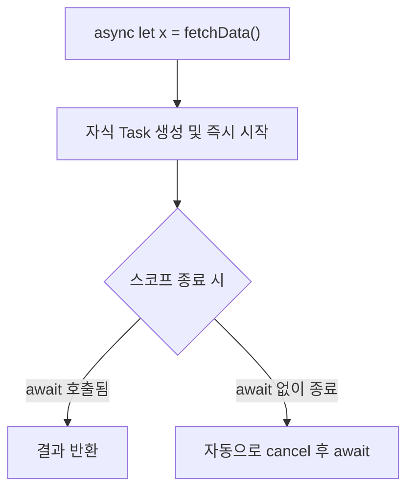
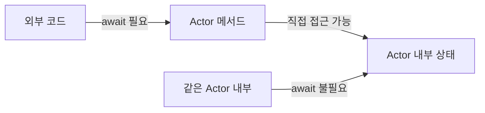
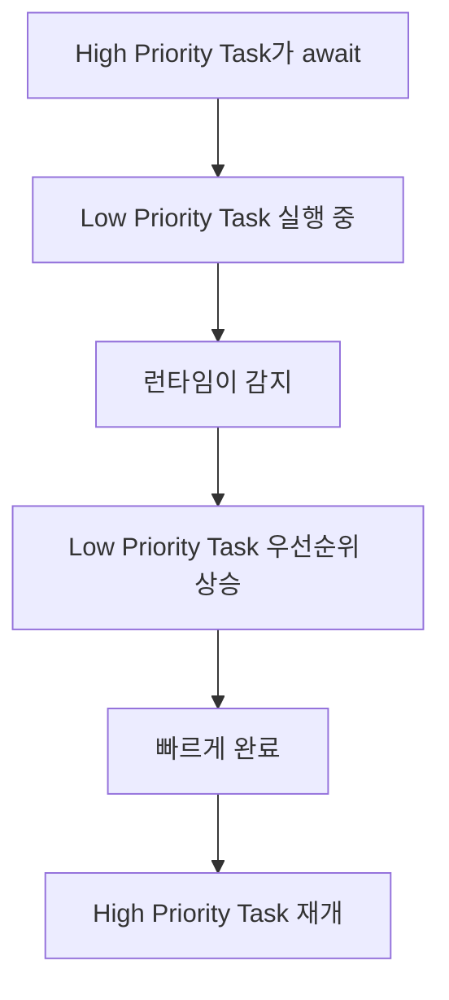

# Swift 6 Concurrency 완벽 가이드

> Swift 공식 레포지토리 소스 코드를 기반으로 한 심층 스터디 노트
> 
> 참조: [swiftlang/swift](https://github.com/swiftlang/swift) - `stdlib/public/Concurrency/`

---

## 목차

1. [Part 1: 핵심 키워드 (async/await)](#part-1-핵심-키워드-asyncawait)
2. [Part 2: AsyncSequence](#part-2-asyncsequence)
3. [Part 3: Task 관련](#part-3-task-관련)
4. [Part 4: Actor & Isolation](#part-4-actor--isolation)
5. [Part 5: Sendability & Safety](#part-5-sendability--safety)
6. [Part 6: Continuation (콜백 래핑)](#part-6-continuation-콜백-래핑)
7. [Part 7: Swift 6 강화 포인트](#part-7-swift-6-강화-포인트)
8. [Part 8: 운영 & 런타임 환경](#part-8-운영--런타임-환경)

---

# Part 1: 핵심 키워드 (async/await)

## 1.1 async 키워드

`async`는 함수가 **비동기적으로 실행될 수 있음**을 표시합니다. async 함수는 호출 시점에 **일시 중단(suspend)**될 수 있으며, 나중에 **재개(resume)**됩니다.

```swift
// 비동기 함수 선언
func fetchData() async -> Data {
    // 네트워크 요청 등의 비동기 작업
    return data
}

// 비동기 프로퍼티
var asyncProperty: String {
    get async {
        return await computeValue()
    }
}
```

### async 함수의 특징

| 특징 | 설명 |
|-----|------|
| **일시 중단 가능** | 실행 중 suspend point에서 일시 중단될 수 있음 |
| **스레드 비점유** | 일시 중단 시 실행 중이던 스레드를 해제 |
| **순차적 실행** | await 지점에서 결과를 기다린 후 다음 코드 실행 |

## 1.2 await 키워드

`await`는 async 함수를 **호출하고 결과를 기다리는** 지점을 표시합니다. 이 지점이 **suspension point(일시 중단 지점)**입니다.

```swift
func processData() async {
    // await 키워드로 비동기 함수 호출
    let result = await fetchData()
    
    // 여러 await 순차 실행
    let user = await fetchUser()
    let posts = await fetchPosts(for: user)
}
```

### Suspension Point의 의미

```
┌─────────────────────────────────────────┐
│           Task Execution                │
├─────────────────────────────────────────┤
│  코드 실행 ──► await ──► 일시 중단      │
│                  │                      │
│                  ▼                      │
│        (다른 Task가 실행될 수 있음)      │
│                  │                      │
│                  ▼                      │
│  결과 도착 ──► 재개 ──► 코드 계속 실행   │
└─────────────────────────────────────────┘
```

## 1.3 try await 조합

에러를 던질 수 있는 비동기 함수를 호출할 때 사용합니다.

```swift
// throws + async 함수 선언
func fetchUser(id: Int) async throws -> User {
    guard id > 0 else {
        throw UserError.invalidId
    }
    return await networkRequest(for: id)
}

// 호출 시 try await 사용
func loadUser() async {
    do {
        let user = try await fetchUser(id: 123)
        print("User loaded: \(user)")
    } catch {
        print("Failed to load user: \(error)")
    }
}
```

> [!TIP]
> `try`와 `await`의 순서: `try await`로 작성합니다. 에러 처리(try)가 비동기 대기(await)보다 먼저 해석됩니다.

## 1.4 async let (병렬 바인딩)

`async let`은 **Structured Concurrency**의 핵심 기능으로, 여러 비동기 작업을 **병렬로 시작**하고 나중에 결과를 **수집**할 수 있게 합니다.

```swift
func fetchAllData() async throws -> (User, [Post], [Comment]) {
    // 세 작업을 동시에 시작 (병렬 실행)
    async let user = fetchUser()
    async let posts = fetchPosts()
    async let comments = fetchComments()
    
    // 모든 결과를 기다림
    return try await (user, posts, comments)
}
```

### 순차 실행 vs 병렬 실행 비교

```swift
// ❌ 순차 실행 - 총 시간: 1초 + 1초 + 1초 = 3초
func sequential() async {
    let a = await task1() // 1초
    let b = await task2() // 1초  
    let c = await task3() // 1초
}

// ✅ 병렬 실행 - 총 시간: max(1초, 1초, 1초) = 1초
func parallel() async {
    async let a = task1()
    async let b = task2()
    async let c = task3()
    
    let results = await (a, b, c)
}
```

### async let의 생명주기



> [!IMPORTANT]
> `async let`으로 선언된 값은 반드시 사용되기 전에 `await`해야 합니다. 스코프를 벗어나면 자동으로 취소됩니다.

---

# Part 2: AsyncSequence

## 2.1 AsyncSequence 프로토콜

`AsyncSequence`는 비동기적으로 요소를 생성하는 시퀀스입니다. 일반 `Sequence`와 유사하지만, 각 요소를 가져올 때 `await`가 필요합니다.

```swift
// AsyncSequence 프로토콜 정의 (stdlib/public/Concurrency/AsyncSequence.swift 참조)
@available(SwiftStdlib 5.1, *)
public protocol AsyncSequence<Element, Failure> {
    associatedtype AsyncIterator: AsyncIteratorProtocol 
        where AsyncIterator.Element == Element
    associatedtype Element
    
    @available(SwiftStdlib 6.0, *)
    associatedtype Failure: Error = any Error
        where AsyncIterator.Failure == Failure
    
    __consuming func makeAsyncIterator() -> AsyncIterator
}
```

## 2.2 for await 구문

```swift
// 기본 사용법
for await number in Counter(howHigh: 10) {
    print(number, terminator: " ")
}
// 출력: 1 2 3 4 5 6 7 8 9 10

// try와 함께 사용
for try await line in fileHandle.bytes.lines {
    process(line)
}
```

### AsyncIteratorProtocol

```swift
// AsyncIteratorProtocol 정의
public protocol AsyncIteratorProtocol<Element, Failure> {
    associatedtype Element
    associatedtype Failure: Error = any Error
    
    mutating func next() async throws(Failure) -> Element?
}
```

## 2.3 AsyncStream

`AsyncStream`은 콜백 기반 API를 `AsyncSequence`로 변환하는 브릿지입니다.

```swift
// AsyncStream 생성
let stream = AsyncStream<Int> { continuation in
    for i in 1...5 {
        continuation.yield(i)
    }
    continuation.finish()
}

// 사용
for await value in stream {
    print(value)
}
```

### AsyncStream 활용 예제: NotificationCenter 래핑

```swift
extension NotificationCenter {
    func notifications(named name: Notification.Name) -> AsyncStream<Notification> {
        AsyncStream { continuation in
            let observer = addObserver(forName: name, object: nil, queue: nil) { notification in
                continuation.yield(notification)
            }
            
            continuation.onTermination = { @Sendable _ in
                removeObserver(observer)
            }
        }
    }
}

// 사용
for await notification in NotificationCenter.default.notifications(named: .myNotification) {
    handle(notification)
}
```

## 2.4 AsyncSequence 연산자

| 연산자 | 설명 | 예제 |
|-------|------|------|
| `map` | 각 요소 변환 | `stream.map { $0 * 2 }` |
| `filter` | 조건에 맞는 요소만 | `stream.filter { $0 > 5 }` |
| `compactMap` | nil 제외하고 변환 | `stream.compactMap { Int($0) }` |
| `flatMap` | 중첩 시퀀스 평탄화 | `stream.flatMap { $0.children }` |
| `prefix` | 처음 n개만 | `stream.prefix(5)` |
| `drop` | 처음 n개 건너뛰기 | `stream.dropFirst(3)` |

```swift
// 연산자 체이닝
let result = await stream
    .filter { $0 % 2 == 0 }
    .map { $0 * 10 }
    .prefix(5)
    .reduce(0, +)
```

---

# Part 3: Task 관련

## 3.1 Task 기본

`Task`는 Swift Concurrency의 **실행 단위**입니다. 모든 비동기 코드는 Task 내에서 실행됩니다.

```swift
// Task 구조체 정의 (stdlib/public/Concurrency/Task.swift 참조)
@available(SwiftStdlib 5.1, *)
@frozen
public struct Task<Success: Sendable, Failure: Error>: Sendable {
    internal let _task: Builtin.NativeObject
    
    // 결과 접근
    public var value: Success {
        get async throws {
            return try await _taskFutureGetThrowing(_task)
        }
    }
    
    // 취소
    public func cancel() {
        Builtin.cancelAsyncTask(_task)
    }
}
```

### Task 생성

```swift
// 기본 Task 생성 - 현재 actor 컨텍스트 상속
Task {
    await doWork()
}

// 우선순위 지정
Task(priority: .high) {
    await importantWork()
}

// 결과 가져오기
let task = Task { () -> Int in
    return await computeValue()
}
let result = await task.value
```

## 3.2 Task.detached

`Task.detached`는 **현재 컨텍스트에서 완전히 분리된** 독립적인 Task를 생성합니다.

```swift
// Detached Task - actor isolation, priority, task locals 상속 안함
Task.detached {
    await doIndependentWork()
}

Task.detached(priority: .background) {
    await backgroundTask()
}
```

### Task vs Task.detached 비교

| 특성 | `Task { }` | `Task.detached { }` |
|-----|------------|---------------------|
| Actor isolation 상속 | ✅ Yes | ❌ No |
| Priority 상속 | ✅ Yes | ❌ No |
| Task-local values 상속 | ✅ Yes | ❌ No |
| 사용 시점 | 현재 컨텍스트 유지 필요 시 | 완전 독립 실행 필요 시 |

```swift
@MainActor
class ViewController {
    func loadData() {
        // Task: MainActor isolation 상속
        Task {
            let data = await fetchData()
            updateUI(data) // ✅ MainActor에서 실행
        }
        
        // Task.detached: MainActor isolation 상속 안함
        Task.detached {
            let data = await fetchData()
            // updateUI(data) // ❌ MainActor가 아님!
            await MainActor.run {
                updateUI(data) // ✅ 명시적 MainActor 전환 필요
            }
        }
    }
}
```

## 3.3 TaskGroup / withTaskGroup

`TaskGroup`은 **동적인 수의 자식 Task**를 관리하는 Structured Concurrency 도구입니다.

```swift
// 기본 사용법
func fetchAllImages(urls: [URL]) async throws -> [Image] {
    try await withThrowingTaskGroup(of: Image.self) { group in
        for url in urls {
            group.addTask {
                try await downloadImage(from: url)
            }
        }
        
        var images: [Image] = []
        for try await image in group {
            images.append(image)
        }
        return images
    }
}
```

### TaskGroup 변형들

| 타입 | 용도 |
|-----|------|
| `withTaskGroup` | 에러를 던지지 않는 그룹 |
| `withThrowingTaskGroup` | 에러를 던질 수 있는 그룹 |
| `withDiscardingTaskGroup` | 결과를 버리는 그룹 (Swift 5.9+) |
| `withThrowingDiscardingTaskGroup` | 결과를 버리고 에러 던지는 그룹 |

### DiscardingTaskGroup (Swift 5.9+)

결과를 수집할 필요 없이 **부수 효과(side effect)**만 필요할 때 사용합니다.

```swift
// stdlib/public/Concurrency/DiscardingTaskGroup.swift 참조
await withDiscardingTaskGroup { group in
    for item in items {
        group.addTask {
            await processItem(item) // 결과 무시, 부수 효과만
        }
    }
}
// 모든 작업 완료 보장
```

> [!NOTE]
> `DiscardingTaskGroup`은 결과를 즉시 해제하여 메모리 효율이 좋습니다. `next()` 호출이 필요 없습니다.

## 3.4 Task.sleep

`Task.sleep`은 현재 Task를 지정된 시간 동안 **일시 중단**합니다. **스레드를 차단하지 않습니다**.

```swift
// 나노초 단위 (구버전)
try await Task.sleep(nanoseconds: 1_000_000_000) // 1초

// Duration 사용 (Swift 5.7+, 권장)
try await Task.sleep(for: .seconds(1))
try await Task.sleep(for: .milliseconds(500))

// Clock 사용
try await Task.sleep(until: .now + .seconds(2), clock: .continuous)
```

### sleep 취소 처리

```swift
do {
    try await Task.sleep(for: .seconds(10))
} catch is CancellationError {
    print("Sleep was cancelled")
}
```

## 3.5 Task.cancel() / Task.isCancelled

Swift의 Task 취소는 **협력적(cooperative)**입니다. 취소를 요청해도 Task가 자동으로 멈추지 않습니다.

```swift
// 취소 요청
let task = Task {
    for i in 1...100 {
        // 취소 확인 (방법 1: 직접 확인)
        if Task.isCancelled {
            print("Cancelled at \(i)")
            return
        }
        
        // 취소 확인 (방법 2: 에러 던지기)
        try Task.checkCancellation()
        
        await doWork(i)
    }
}

// 나중에 취소 요청
task.cancel()
```

### withTaskCancellationHandler

```swift
// 취소 시 즉시 실행되는 핸들러 등록
await withTaskCancellationHandler {
    // 메인 작업
    await longRunningWork()
} onCancel: {
    // 취소 발생 시 즉시 호출 (다른 스레드에서 실행될 수 있음!)
    cleanupResources()
}
```

> [!WARNING]
> `onCancel` 핸들러는 **동시에 실행**될 수 있으므로, 공유 상태 접근 시 **Sendable** 요구사항을 준수해야 합니다.

## 3.6 TaskPriority

```swift
// 우선순위 레벨
public struct TaskPriority: RawRepresentable, Sendable {
    public static let high: TaskPriority        // 0x19 (25)
    public static var medium: TaskPriority      // 0x15 (21)
    public static let low: TaskPriority         // 0x11 (17)
    public static let userInitiated: TaskPriority = high
    public static let utility: TaskPriority = low
    public static let background: TaskPriority  // 0x09 (9)
}
```

---

# Part 4: Actor & Isolation

## 4.1 Actor 기본

`actor`는 **공유 가변 상태를 안전하게 보호**하는 참조 타입입니다. 한 번에 하나의 Task만 actor의 상태에 접근할 수 있습니다.

```swift
// Actor 프로토콜 정의 (stdlib/public/Concurrency/Actor.swift 참조)
@available(SwiftStdlib 5.1, *)
public protocol Actor: AnyObject, Sendable {
    nonisolated var unownedExecutor: UnownedSerialExecutor { get }
}
```

### Actor 정의 및 사용

```swift
actor BankAccount {
    private var balance: Int
    
    init(initialBalance: Int) {
        self.balance = initialBalance
    }
    
    func deposit(_ amount: Int) {
        balance += amount
    }
    
    func withdraw(_ amount: Int) -> Bool {
        guard balance >= amount else { return false }
        balance -= amount
        return true
    }
    
    func getBalance() -> Int {
        return balance
    }
}

// 외부에서 접근 시 await 필요
let account = BankAccount(initialBalance: 1000)
await account.deposit(500)
let balance = await account.getBalance()
```

### Actor Isolation 규칙



## 4.2 nonisolated 키워드

`nonisolated`는 actor 내부에 있지만 **isolation이 필요 없는** 멤버를 표시합니다.

```swift
actor UserManager {
    let id: UUID  // 상수는 암묵적으로 nonisolated
    var name: String
    
    // 명시적 nonisolated - await 없이 외부에서 접근 가능
    nonisolated var displayId: String {
        return id.uuidString
    }
    
    // nonisolated 메서드
    nonisolated func generateHash() -> Int {
        return id.hashValue
    }
}

let manager = UserManager(...)
print(manager.displayId)  // await 불필요!
```

> [!IMPORTANT]
> `nonisolated` 멤버는 actor의 **가변 상태에 접근할 수 없습니다**.

## 4.3 @MainActor

`@MainActor`는 **메인 스레드에서 실행되어야 하는** 코드를 표시하는 Global Actor입니다.

```swift
// MainActor 정의 (stdlib/public/Concurrency/MainActor.swift 참조)
@available(SwiftStdlib 5.1, *)
@globalActor public final actor MainActor: GlobalActor {
    public static let shared = MainActor()
    
    // MainActor의 executor는 main dispatch queue와 동등
    @inlinable
    public nonisolated var unownedExecutor: UnownedSerialExecutor {
        return unsafe UnownedSerialExecutor(Builtin.buildMainActorExecutorRef())
    }
    
    // 명시적으로 MainActor에서 실행
    @_alwaysEmitIntoClient
    public static func run<T: Sendable>(
        resultType: T.Type = T.self,
        body: @MainActor @Sendable () throws -> T
    ) async rethrows -> T {
        return try await body()
    }
}
```

### @MainActor 사용법

```swift
// 클래스 전체에 적용
@MainActor
class ViewController: UIViewController {
    var data: [String] = []  // MainActor에서만 접근 가능
    
    func updateUI() {  // MainActor에서 실행됨
        tableView.reloadData()
    }
}

// 개별 메서드에 적용
class DataManager {
    @MainActor
    func refreshUI() {
        // UI 업데이트
    }
}

// MainActor.run 사용
Task.detached {
    let data = await fetchData()
    await MainActor.run {
        self.updateUI(with: data)
    }
}
```

### MainActor.assumeIsolated

동기 코드에서 MainActor isolation을 **가정하고 확인**합니다.

```swift
// 런타임에 MainActor에서 실행 중인지 확인
@available(SwiftStdlib 5.9, *)
MainActor.assumeIsolated {
    // MainActor에서 실행 중이면 이 클로저 실행
    // 아니면 fatalError
    updateUI()
}
```

## 4.4 Global Actor

`@globalActor`로 자신만의 Global Actor를 정의할 수 있습니다.

```swift
// GlobalActor 프로토콜 (stdlib/public/Concurrency/GlobalActor.swift 참조)
@available(SwiftStdlib 5.1, *)
public protocol GlobalActor {
    associatedtype ActorType: Actor
    static var shared: ActorType { get }
    static var sharedUnownedExecutor: UnownedSerialExecutor { get }
}

// 커스텀 Global Actor 정의
@globalActor
actor DatabaseActor: GlobalActor {
    static let shared = DatabaseActor()
}

// 사용
@DatabaseActor
func saveToDatabase(_ data: Data) async {
    // DatabaseActor에서 실행됨
}
```

## 4.5 isolated 매개변수

Swift 6에서 강화된 기능으로, **함수 매개변수로 actor isolation을 전달**할 수 있습니다.

```swift
// isolated 매개변수 사용
func process(on actor: isolated MyActor) async {
    // actor의 내부 상태에 직접 접근 가능 (await 불필요)
    actor.privateData.append(newItem)
}

// Swift 6: 프로토콜에서도 사용
protocol Processable: Actor {
    func doWork(on isolated: Self) async
}
```

## 4.6 Actor Reentrancy

Actor의 메서드가 `await`에서 일시 중단되면, **다른 호출이 실행될 수 있습니다**. 이를 **Reentrancy**라고 합니다.

```swift
actor Counter {
    var count = 0
    
    func increment() async {
        let current = count
        await Task.sleep(for: .seconds(1))  // ⚠️ 여기서 다른 호출이 실행될 수 있음!
        count = current + 1  // 예상과 다른 결과 발생 가능
    }
}

// 문제 시나리오
let counter = Counter()
await withTaskGroup(of: Void.self) { group in
    for _ in 0..<10 {
        group.addTask {
            await counter.increment()
        }
    }
}
// count가 10이 아닐 수 있음!
```

### Reentrancy 해결 방법

```swift
actor SafeCounter {
    var count = 0
    
    // 방법 1: await 이후 상태 재확인
    func incrementSafely() async {
        count += 1  // await 없이 원자적 수정
    }
    
    // 방법 2: 상태 체크 후 진행
    func incrementIfValid() async -> Bool {
        let wasValid = count < 100
        guard wasValid else { return false }
        
        await doAsyncWork()
        
        // await 후 다시 확인!
        guard count < 100 else { return false }
        count += 1
        return true
    }
}
```

> [!CAUTION]
> Actor 메서드에서 `await` 후에는 **모든 가정을 다시 검증**해야 합니다. 상태가 변경되었을 수 있습니다.

---

# Part 5: Sendability & Safety

## 5.1 Sendable 프로토콜

`Sendable`은 **동시성 도메인 간에 안전하게 전달**될 수 있는 타입을 표시합니다.

```swift
// Sendable 프로토콜 정의 (stdlib/public/core/Sendable.swift 참조)
@_marker public protocol Sendable: SendableMetatype, ~Copyable, ~Escapable { }
```

### Sendable 자동 준수 조건

| 타입 | 자동 Sendable |
|-----|--------------|
| 값 타입 (struct/enum) | 모든 저장 프로퍼티가 Sendable이면 ✅ |
| Actor | 항상 ✅ |
| final class | 불변 + Sendable 프로퍼티만 ✅ |
| Functions/Closures | `@Sendable` 표시 필요 |

```swift
// ✅ 자동으로 Sendable
struct Point: Sendable {
    let x: Int
    let y: Int
}

// ✅ 자동으로 Sendable (Frozen이 아니어도 내부 모듈에서는 자동)
struct User {
    let id: UUID
    let name: String
}

// ❌ Sendable 아님 (class + 가변 상태)
class Counter {
    var count = 0
}
```

## 5.2 @unchecked Sendable

컴파일러가 검증할 수 없지만 **개발자가 스레드 안전성을 보장**할 때 사용합니다.

```swift
// Lock으로 보호되는 클래스
final class ThreadSafeCache<Key: Hashable, Value>: @unchecked Sendable {
    private var cache: [Key: Value] = [:]
    private let lock = NSLock()
    
    func get(_ key: Key) -> Value? {
        lock.lock()
        defer { lock.unlock() }
        return cache[key]
    }
    
    func set(_ key: Key, value: Value) {
        lock.lock()
        defer { lock.unlock() }
        cache[key] = value
    }
}
```

> [!WARNING]
> `@unchecked Sendable`은 컴파일러 검사를 **우회**합니다. 스레드 안전성은 **개발자 책임**입니다.

## 5.3 @Sendable 클로저

클로저가 **동시성 경계를 넘어 안전하게 전달**될 수 있음을 표시합니다.

```swift
// @Sendable 클로저 타입
let sendableClosure: @Sendable () -> Void = {
    print("Hello from closure")
}

// Task.detached는 @Sendable 클로저 요구
Task.detached { @Sendable in
    await doWork()
}

// @Sendable 클로저의 캡처 제한
class MyClass {
    var value = 0
    
    func example() {
        Task { @Sendable in
            // self.value = 10  // ❌ 에러! non-Sendable 캡처
        }
    }
}
```

### @Sendable 클로저 규칙

1. **값으로만 캡처** (by-value capture)
2. **캡처하는 모든 값이 Sendable**이어야 함
3. **가변 참조 캡처 불가**

```swift
func example() {
    let immutableValue = 42  // ✅ Sendable 값
    var mutableValue = 0     // ❌ 가변 변수
    
    let closure: @Sendable () -> Void = {
        print(immutableValue)  // ✅ OK
        // print(mutableValue)  // ❌ 에러
    }
}
```

## 5.4 데이터 레이스 검출 (Swift 6)

Swift 6는 **컴파일 타임에 데이터 레이스를 검출**합니다.

```swift
// Swift 6 Strict Concurrency 모드에서
class Counter {
    var count = 0  // ⚠️ 경고: Non-Sendable 타입
}

let counter = Counter()

Task {
    counter.count += 1  // ❌ 에러: Data race 가능성
}

Task {
    counter.count += 1  // ❌ 에러: Data race 가능성
}
```

### 해결 방법

```swift
// 방법 1: Actor 사용
actor SafeCounter {
    var count = 0
    func increment() { count += 1 }
}

// 방법 2: @MainActor 격리
@MainActor
class UICounter {
    var count = 0
}

// 방법 3: Sendable로 래핑
final class AtomicCounter: @unchecked Sendable {
    private var _count = 0
    private let lock = NSLock()
    
    func increment() {
        lock.withLock { _count += 1 }
    }
}
```

---

# Part 6: Continuation (콜백 래핑)

## 6.1 withCheckedContinuation

기존 콜백 기반 API를 `async/await`로 변환합니다.

```swift
// CheckedContinuation 구조 (stdlib/public/Concurrency/CheckedContinuation.swift 참조)
@available(SwiftStdlib 5.1, *)
public struct CheckedContinuation<T, E: Error>: Sendable {
    public func resume(returning value: T)
    public func resume(throwing error: E)
    public func resume(with result: Result<T, E>)
}
```

### 기본 사용법

```swift
// 콜백 API를 async로 변환
func fetchUserAsync() async -> User {
    await withCheckedContinuation { continuation in
        // 기존 콜백 기반 API 호출
        fetchUser { user in
            continuation.resume(returning: user)
        }
    }
}
```

## 6.2 withCheckedThrowingContinuation

에러를 던질 수 있는 버전입니다.

```swift
func fetchDataAsync() async throws -> Data {
    try await withCheckedThrowingContinuation { continuation in
        networkRequest { result in
            switch result {
            case .success(let data):
                continuation.resume(returning: data)
            case .failure(let error):
                continuation.resume(throwing: error)
            }
        }
    }
}

// Result로 간편하게
func fetchDataAsync() async throws -> Data {
    try await withCheckedThrowingContinuation { continuation in
        networkRequest { result in
            continuation.resume(with: result)
        }
    }
}
```

## 6.3 Checked vs Unsafe Continuation

| 타입 | 검사 | 성능 | 사용 시점 |
|-----|-----|-----|---------|
| `withCheckedContinuation` | 런타임 검사 ✅ | 약간 느림 | 개발/디버그 |
| `withUnsafeContinuation` | 검사 없음 ❌ | 빠름 | 프로덕션 (검증 완료 시) |

```swift
// Unsafe 버전 (프로덕션용)
func fetchUserFast() async -> User {
    await withUnsafeContinuation { continuation in
        fetchUser { user in
            continuation.resume(returning: user)
        }
    }
}
```

> [!CAUTION]
> Continuation은 **정확히 한 번만** resume되어야 합니다. 두 번 호출하거나 호출하지 않으면 **정의되지 않은 동작**이 발생합니다.

### 흔한 실수 패턴

```swift
// ❌ 잘못된 예: 두 번 resume
func badExample() async -> Int {
    await withCheckedContinuation { continuation in
        doSomething { result in
            continuation.resume(returning: result)
        }
        continuation.resume(returning: 0)  // ❌ 크래시!
    }
}

// ❌ 잘못된 예: resume하지 않음
func neverResumes() async -> Int {
    await withCheckedContinuation { continuation in
        // 조건에 따라 resume을 안 할 수 있음
        if someCondition {
            return  // ❌ resume 없이 종료 - 영원히 대기!
        }
        continuation.resume(returning: 42)
    }
}

// ✅ 올바른 예
func correctExample() async -> Int {
    await withCheckedContinuation { continuation in
        doSomething { result in
            if let value = result {
                continuation.resume(returning: value)
            } else {
                continuation.resume(returning: 0)  // 항상 resume
            }
        }
    }
}
```

---

# Part 7: Swift 6 강화 포인트

## 7.1 Strict Concurrency

Swift 6에서는 **Strict Concurrency**가 기본값입니다. 모든 동시성 관련 문제가 **컴파일 에러**가 됩니다.

```swift
// Swift 5 모드 (경고)
// -strict-concurrency=complete

// Swift 6 모드 (에러)
// 기본 활성화

// Package.swift에서 설정
.target(
    name: "MyTarget",
    swiftSettings: [
        .enableExperimentalFeature("StrictConcurrency")
    ]
)
```

### Strict Concurrency 체크 항목

| 검사 항목 | 설명 |
|---------|------|
| Sendable 체크 | 동시성 경계를 넘는 모든 값 검증 |
| Actor isolation | 격리 위반 검출 |
| 글로벌 가변 상태 | 글로벌 변수 접근 제한 |
| 클로저 캡처 | @Sendable 클로저 캡처 검증 |

## 7.2 Regional Isolation

Swift 6는 **지역 격리(Regional Isolation)**를 도입하여 더 정밀한 분석을 수행합니다.

```swift
// Swift 6: 컴파일러가 값의 "지역"을 추적
func example() {
    var localData = [1, 2, 3]  // 지역 데이터
    
    Task {
        // 컴파일러가 localData가 다른 지역에서 
        // 접근되지 않음을 증명하면 허용
        print(localData)
    }
    
    // localData는 여기서 더 이상 사용 안 함
}
```

## 7.3 Compile-time Data Race Checking

Swift 6의 핵심 기능: **컴파일 타임에 데이터 레이스 검출**

```swift
class NotSendable {
    var value = 0
}

func example() {
    let obj = NotSendable()
    
    Task {
        obj.value = 1  // ❌ Swift 6 에러: 
                       // Capture of 'obj' with non-sendable type 
                       // 'NotSendable' in a `@Sendable` closure
    }
}
```

## 7.4 Sendable Inference 강제

Swift 6에서는 **Sendable 추론이 더 엄격**해집니다.

```swift
// Swift 5: 암묵적으로 Sendable일 수 있음
// Swift 6: 명시적 선언 필요

// ✅ 명시적 Sendable
struct MyData: Sendable {
    let id: Int
    let name: String
}

// public 타입은 반드시 명시해야 함
public struct PublicData: Sendable {
    public let value: Int
}
```

## 7.5 nonisolated 요구사항 증가

Swift 6에서는 `nonisolated` 사용이 더 자주 필요합니다.

```swift
actor MyActor {
    var state = 0
    
    // Swift 6: Hashable 등 프로토콜 요구사항 구현 시
    // nonisolated 필요할 수 있음
    nonisolated func hash(into hasher: inout Hasher) {
        hasher.combine(ObjectIdentifier(self))
    }
}
```

---

# Part 8: 운영 & 런타임 환경

## 8.1 Cooperative Cancellation

Swift의 취소는 **협력적**입니다. 취소를 요청해도 Task가 자동으로 중단되지 않습니다.

```swift
// 취소 모델 흐름
let task = Task {
    for i in 1...1000 {
        // 1. 명시적 취소 확인
        guard !Task.isCancelled else {
            print("Cancelled!")
            return
        }
        
        // 2. 또는 에러 던지기
        try Task.checkCancellation()
        
        await process(i)
    }
}

// 취소 요청 (즉시 중단되지 않음!)
task.cancel()
```

### 왜 협력적 취소인가?

| 강제 취소 | 협력적 취소 |
|---------|-----------|
| 리소스 누수 가능 | 정리 코드 실행 보장 |
| 불일치 상태 가능 | 일관된 상태 유지 |
| 예측 불가 | 예측 가능한 동작 |

## 8.2 Priority Inheritance

낮은 우선순위 Task가 높은 우선순위 Task를 **차단하는 것을 방지**합니다.

```swift
// Priority Inversion 문제
actor SharedResource {
    var data: Data?
    
    func loadData() async -> Data {
        if let data = data { return data }
        data = await fetchData()  // 오래 걸림
        return data!
    }
}

// 낮은 우선순위 Task가 먼저 actor에 접근
let lowPriorityTask = Task(priority: .background) {
    await resource.loadData()  // actor 점유 중
}

// 높은 우선순위 Task가 대기
let highPriorityTask = Task(priority: .high) {
    await resource.loadData()  // 대기중...
}

// Swift 런타임이 자동으로:
// lowPriorityTask의 우선순위를 일시적으로 높여서
// 빨리 완료되도록 함 (Priority Inheritance)
```

### Priority Escalation 동작



## 8.3 Hop to MainActor (메인 전환 비용)

MainActor로 전환은 **비용이 발생**합니다. 불필요한 전환을 피해야 합니다.

```swift
// ❌ 비효율적: 매번 MainActor 전환
func updateUI(items: [Item]) async {
    for item in items {
        await MainActor.run {
            addItemToUI(item)  // 각 아이템마다 전환!
        }
    }
}

// ✅ 효율적: 한 번에 전환
func updateUIEfficiently(items: [Item]) async {
    await MainActor.run {
        for item in items {
            addItemToUI(item)  // 한 번의 전환
        }
    }
}

// ✅ 더 좋음: @MainActor 메서드 사용
@MainActor
func updateUIBest(items: [Item]) {
    for item in items {
        addItemToUI(item)
    }
}
```

### Hop 비용 최소화 전략

1. **일괄 처리**: 여러 UI 업데이트를 하나의 MainActor.run에서
2. **@MainActor 활용**: 전체 메서드/클래스에 적용
3. **불필요한 await 제거**: 이미 같은 actor에 있다면 await 불필요

## 8.4 Concurrency Runtime

Swift Concurrency 런타임의 핵심 구성요소:

### Task Executor

```swift
// Executor 프로토콜 (stdlib/public/Concurrency/Executor.swift 참조)
@available(SwiftStdlib 5.1, *)
public protocol Executor: AnyObject, Sendable {
    func enqueue(_ job: consuming ExecutorJob)
}

@available(SwiftStdlib 5.1, *)
public protocol SerialExecutor: Executor {
    func asUnownedSerialExecutor() -> UnownedSerialExecutor
    func isSameExclusiveExecutionContext(other: Self) -> Bool
}
```

### Global Concurrent Executor

모든 Task가 기본적으로 실행되는 **공유 스레드 풀**입니다.

```swift
// 시스템이 관리하는 스레드 풀
// - CPU 코어 수에 맞게 스레드 수 조절
// - 스레드 재사용
// - 워크 스틸링 (work stealing)

// preferredExecutor 지정 가능
Task(executorPreference: myCustomExecutor) {
    await doWork()
}
```

### 런타임 최적화

| 최적화 | 설명 |
|-------|------|
| **스레드 재사용** | Task 전환 시 스레드 변경 최소화 |
| **Work Stealing** | 유휴 스레드가 다른 큐에서 작업 가져옴 |
| **Inline Execution** | 가능하면 같은 스레드에서 계속 실행 |
| **Stack 재사용** | 일시 중단된 Task의 스택 최적화 |

---

# 부록: 빠른 참조표

## A. async/await 문법

```swift
// 함수 선언
func fetch() async -> Data
func fetch() async throws -> Data

// 호출
let data = await fetch()
let data = try await fetch()

// 병렬 실행
async let a = fetchA()
async let b = fetchB()
let (resultA, resultB) = await (a, b)
```

## B. Task 생성

```swift
// 기본 Task (컨텍스트 상속)
Task { await work() }

// 분리된 Task
Task.detached { await work() }

// 우선순위 지정
Task(priority: .high) { await work() }

// TaskGroup
await withTaskGroup(of: Int.self) { group in
    group.addTask { await compute() }
}
```

## C. Actor 정의

```swift
actor MyActor {
    var state: Int = 0
    
    func update() { state += 1 }
    
    nonisolated var id: UUID { UUID() }
}

@globalActor
actor MyGlobalActor: GlobalActor {
    static let shared = MyGlobalActor()
}
```

## D. Sendable 패턴

```swift
// 값 타입 (자동)
struct Data: Sendable { let value: Int }

// 클래스 (수동/unchecked)
final class SafeClass: @unchecked Sendable {
    private let lock = NSLock()
    private var data: Int = 0
}

// 클로저
let closure: @Sendable () -> Void = { }
```

## E. Continuation

```swift
// 값 반환
await withCheckedContinuation { continuation in
    callback { result in
        continuation.resume(returning: result)
    }
}

// 에러 처리
try await withCheckedThrowingContinuation { continuation in
    callback { result in
        continuation.resume(with: result)
    }
}
```

---

> 📚 **참고 자료**
> - [Swift 공식 레포지토리](https://github.com/swiftlang/swift)
> - [The Swift Programming Language - Concurrency](https://docs.swift.org/swift-book/LanguageGuide/Concurrency.html)
> - [Swift Evolution Proposals](https://github.com/swiftlang/swift-evolution)
